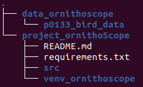

<h1 align="center">Project OrnithoScope</h3>


<!-- TABLE OF CONTENTS -->
<details>
  <summary>Table of content</summary>
  <ol>
    <li>
      <a href="#about-the-project">About the project</a>
    </li>
    <li>
      <a href="#getting-started">Getting Started</a>
      <ul>
        <li><a href="#prerequisites">Prerequisites</a></li>
        <li><a href="#installation">Virtual environment</a></li>
        <li><a href="#installation">Folder organization</a></li>
      </ul>
    </li>
    <li><a href="#how-it-works">How it works</a></li>
    <li><a href="#how-to-use-it">How to use it</a></li>
    <li><a href="#contact">Contact</a></li>
    <li><a href="#acknowledgments">Acknowledgments</a></li>
  </ol>
</details>


<!-- ABOUT THE PROJECT -->
## About the project
Developed for the ECONNECT project (CNRS-LEFE), OrnithoScope ensures the automatic detection of birds by Deep Learning. Here we developed an algorithm based on MobileNet and YOLO for Raspberry PI.


<!-- GETTING STARTED -->
# Getting Started
## Prerequisites
Depending on your OS, GPU and Drivers, you will need a custom install to use this algorithm. With at least:
* python3
* numpy
* pandas
* keras
* sklearn
* tensorflow
* bbaug

## Virtual environment
For that, you can use a virtual environment with [python venv](https://docs.python.org/3/library/venv.html)
```
cd project_ornithoscope
python3 -m venv venv_ornithoScope
source venv_ornithoscope/bin/activate
# optionnal: (depending on your hardware) 
# pip install -r requirements.txt

```
## Folder organization
We recommend you to get the data folder and project folder (with the virtual environment) near by.

<div style="text-align: center;">
  
</div>

<!-- HOW IT WORK -->
# How it works
## Code source folder (project_ornithoscore/src)
In src folder you will find: 
* [train.py](#trainpy) (for training)
* [evaluate.py](#evaluatepy) (for evaluation)
* [predict.py](#predictpy) (for prediction)
### train.py
### evaluate.py
### predict.py

## YOLOV2 folder (project_ornithoscore/src/keras_yolov2)
In this YOLO folder you will find: 
* [backend.py](#backendpy) (to create backend of models)
* [frontend.py](#frontendpy) (to create frontend of models)
* [preprocessing.py](#preprocessingpy) (for preprocessing)
* [map_evaluation.py](#mapevaluationpy) (for evaluation)
* [utils.py](#utilspy) (for utilitarian functions)

### backend.py
### frontend.py
### preprocessing.py
### map_evaluation.py
### utils.py

<!-- HOW TO USE IT -->
# How to use it
```
python3 train.py -c path_custom_config.json
python3 evaluate.py -c path_custom_config.json
python3 predict.py -c path_custom_config.json -w path_seleccted_weights.h5 -i path_image_folder_to_predict
```


- Bouding box viewer :

Show training set images (with bouding boxes) of a config file.
```
python3 boundingbox_viewer.py -c <path to config file>
```
> `[N]` : Next image\
> `[P]` : Previous image\
> `[I]` : Print current image's info


- Cap input :

Cap input count for each class.
```
python3 cap_input.py
```
> `input_path` is hard coded.\
> `cap` is hard coded.


- [Learning rate finder](https://www.avanwyk.com/finding-a-learning-rate-in-tensorflow-2/) :

Plot a graph to find the optimal learning rate.
```
python3 find_lr.py -c <path to config file>
```


- IoU and Score Threshold finder :

Plot a graph to find the bests thresholds.\
You first need to evaluate your config with a high IoU threshold and a low Score threshold.
```
python3 find_thresholds.py
```
> `pickle_path` is hard coded. It referes to the `boxes_*.p` pickle file.\
> `config_path` is hard coded.


- Benchmark generator :

Generate config files based on a template.
```
python3 gen_benchmark.py -c <path to the template config file>
```
> `configs` is a list of dictionnary.\
> Every dictionnary will create a config file replacing the `keys` by its `values`


- Split a train set into train/valid set :

```
python3 gen_valid_input.py
```
> `input_path` is hard coded.\
> `cap` is hard coded.\
> `max_ratio` is hard coded.


- History losses :

Plot the train and validation losses of the training.
```
python3 history.py -c <path to config file>
```
The result will not be plot. You can find the result image at the same location of the history pickle.


- Convert predicted CSVs in JSON : (Not user friendly)

Predicted CSVs must made using the `-o csv_input` option.
```
python3 json_converter.py
```


- Run multiple train :

In `notif.py`, change the `URL` according to a [discord webhook](https://support.discord.com/hc/en-us/articles/228383668-Intro-to-Webhooks) of your discord server.\
In a text file, write every config file you want to train.
```
sh multi_train.sh <path to text file listing config files>
```

- Show evaluation :

Shows images with predicted bounding boxes.
```
python3 show_evaluation.py
```
> `pickle_path` is hard coded. It referes to the `boxes_*.p` or `bad_boxes_*.p` pickle file.


- Convert a model to TFLite :
```
python3 tflite_converter.py -c <path to config file> -l <path to output tflite file>
```


<!-- CONTACT -->
# Contact
SOU Deva [@devasou](https://www.linkedin.com/in/deva-sou/)
